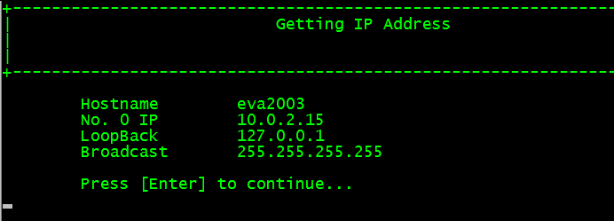

# Notas acerca de direcciones IP y la dirección IP en .NET

Las direcciones IP se dividen en tres clases generales (A, B, C) y dos especializadas que son utilizadas para propósitos experimentales (D, E). Las direcciones IP se representan por cuatro octetos u ocho bits, separados por puntos, así como la dirección MAC nos proporciona identificación, la dirección IP nos da ubicación.

Cada dirección IP se compone de dos campos un campo de red y un campo de host. El tamaño de cada uno de esos campos varía según la clase:
Para la clase A tenemos el primer octeto para identificar la red y los restantes tres para identificar al host.
Para la clase B tenemos los dos primeros octetos para identificar la red y los dos restantes para identificar al host.
Para la clase C tenemos los tres primeros octetos para identificar al host y el último octeto para identificar al host.
El primer octeto en decimal siempre nos indica la clase a la que pertenece una red, dependiendo de su valor en decimal dentro de los siguientes rangos:

<pre>
0 a 127 es clase A

128 a 191 es clase B

192 a 223 es clase C
</pre>

Aquí si observamos el inicio del rango es par y el final es impar.
En la clase A, la dirección IP 127.0.0.1 se reserva como dirección de loopback.

Existen además tipos reservados de IP como por ejemplo si los octetos de host son puestos en 0 (cero) esa dirección IP identifica a la red o si todos los octetos de host son puestos en 1 o 255 en decimal esa dirección IP es una dirección IP de Broadcast.
Una manera de identificar los tipos de red es buscar la posición del bit 0 (cero) dentro del primer octeto, la reglas son:
Si el primer bit es 0 (cero) la dirección es clase A, si el segundo bit es 0 (cero) la dirección es clase B, si el tercer bit es 0 (cero) entonces es clase C. Como en el siguiente esquema:

<pre>
clase A  | 0 1 1 1 1 1 1 1
---------+-----------------
clase B  | 1 0 1 1 1 1 1 1 
---------+----------------
clase C  | 1 1 0 1 1 1 1 1
</pre>
<h3>IP local en .NET</H3>

.Net tiene diversas clases dentro del ensamblado System.Net para el manejo de direcciones IP mostraremos el uso básico de esas clases para obtener la dirección o las direcciones IP de la máquina.
Para acceder a las clases de red, primeramente hacemos referencia a los ensamblados

<pre>
using System.Net;
using System.Net.Sockets;
</pre>

En la siguiente línea

<pre>
IPHostEntry ipinfo = Dns.GetHostByName(Dns.GetHostName());
</pre>

Utilizamos el método GetHostByName de la clase Dns el cual nos devuelve un objeto IPHostEntry del cual utilizamos la propiedad AddressList que es una lista de objetos del tipo IPAddress que representa cada IP de la máquina en caso de tener más de una interface de red y que recorremos con un ciclo utilizando el método GetAddressBytes() para obtener los octetos como un arreglo.

<pre>
foreach(IPAddress ip in  ipinfo.AddressList){
byte[] b = ip.GetAddressBytes();
}
</pre>

Por último utilizamos las propiedades estáticas <i>IPAddress.Loopback</i> y <i>IPAddress.Broadcast</i> para imprimir la dirección Loopback y de Broadcast respectivamente.
Al compilar y ejecutar el programa obtendremos algo similar a lo que se muestra en la siguiente imagen:

